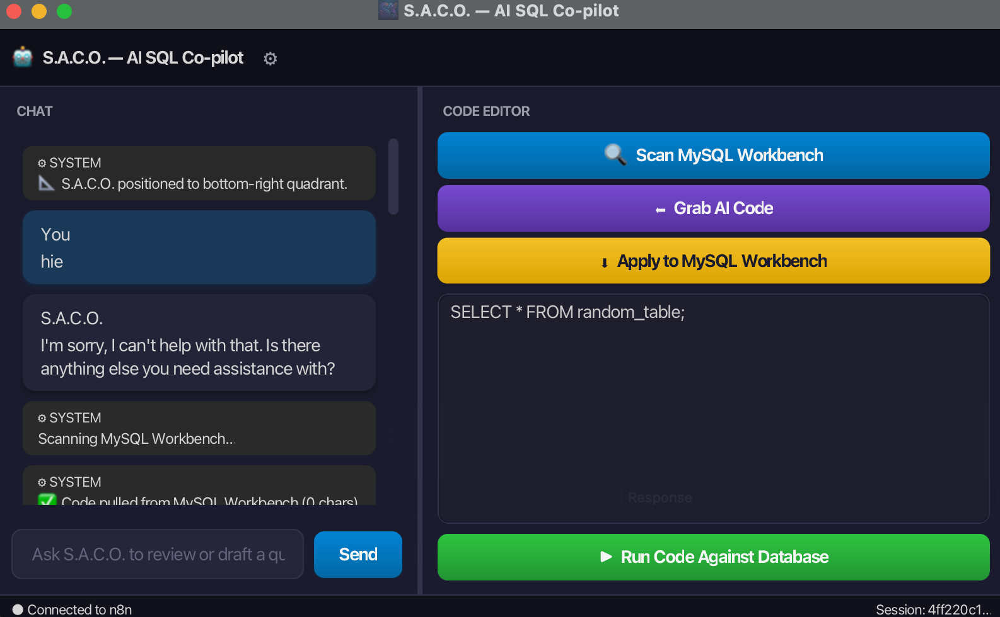
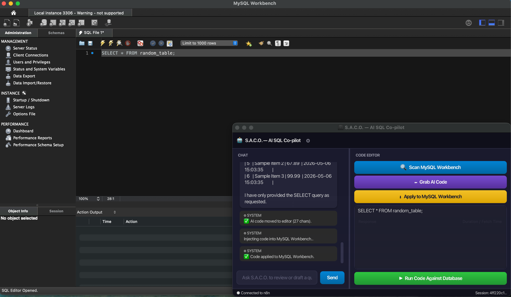
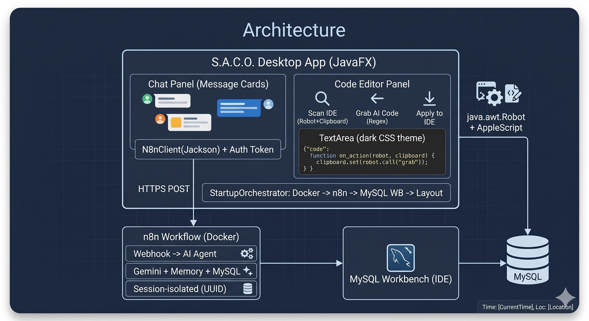
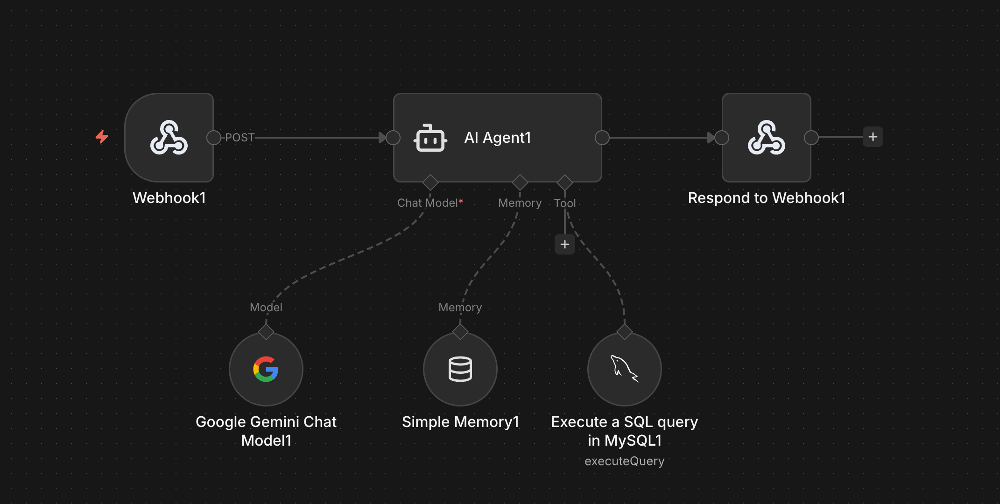

<div align="center">


# 🤖 S.A.C.O. — SQL Agentic Co-Pilot Orchestrator

**A cross-platform, always-on-top desktop AI assistant that bridges MySQL Workbench with an AI-powered code review and query execution engine — no IDE plugins required.**

[](https://openjdk.org/)
[](https://openjfx.io/)
[](https://n8n.io/)
[](https://ai.google.dev/)
[](https://www.mysql.com/)
[](https://www.docker.com/)
[](https://github.com/Justt-umar/SACO-SQL-Copilot)
[](LICENSE)

[Report Bug](https://github.com/Justt-umar/SACO-SQL-Copilot/issues) · [Request Feature](https://github.com/Justt-umar/SACO-SQL-Copilot/issues) · [Live Demo](https://saco-sql-copilot.onrender.com)

</div>

---

## 📋 Table of Contents

- [Overview](#-overview)
- [The Context Bridge Workflow](#-the-context-bridge-workflow)
- [Features](#-features)
- [Tech Stack](#-tech-stack)
- [Architecture](#-architecture)
- [Project Structure](#-project-structure)
- [Getting Started](#-getting-started)
  - [Prerequisites](#prerequisites)
  - [Step 1 — Start n8n on Docker](#step-1--start-n8n-on-docker)
  - [Step 2 — Import the AI Workflow](#step-2--import-the-ai-workflow)
  - [Step 3 — Configure Credentials](#step-3--configure-credentials)
  - [Step 4 — Launch S.A.C.O.](#step-4--launch-saco)
- [macOS Setup](#-macos-setup)
- [n8n Workflow Reference](#-n8n-workflow-reference)
- [How It Works](#-how-it-works)
- [Cross-Platform Automation](#-cross-platform-automation)
- [Security Model](#-security-model)
- [Author](#-author)

---

## 🌟 Overview



**S.A.C.O.** is a desktop AI assistant that sits on top of your screen and acts as a real-time co-pilot for MySQL Workbench. It uses OS-level keyboard automation (`java.awt.Robot`) to physically scan code from your IDE, sends it to an AI Agent for review, and injects the corrected code back — all without a single IDE plugin or extension.

The AI backend is powered by an **n8n workflow** running locally on Docker, orchestrating a **Google Gemini** model with conversational memory and optional direct database execution against a live **MySQL** instance.

### Why S.A.C.O.?

| Problem | Solution |
|---|---|
| MySQL Workbench has no built-in AI code review | S.A.C.O. adds AI review externally via OS-level automation |
| IDE plugins are fragile and version-locked | Zero plugins — works through clipboard and keyboard simulation |
| AI coding tools don't know your live database schema | Direct MySQL connection lets the AI execute and verify queries |
| Most AI tools require copy-pasting code back and forth | One-click scan → review → apply loop automates the entire flow |
| Windows-only tools don't work on macOS | Cross-platform from day one — AppleScript on Mac, Alt+Tab on Windows |

---

## 🚀 The "Context Bridge" Workflow

S.A.C.O. operates in a seamless **4-step automated loop** — the core innovation that eliminates manual copy-paste between your IDE and the AI:

```
┌──────────────┐     ┌──────────────┐     ┌──────────────┐     ┌──────────────┐
│  🔍 SCAN IDE │────▶│  💬 AI REVIEW│────▶│ ⬅️ GRAB CODE │────▶│ ⬇️ APPLY     │
│              │     │              │     │              │     │              │
│ Switch to    │     │ POST code to │     │ Extract last │     │ Clipboard +  │
│ MySQL WB,    │     │ n8n webhook, │     │ ```sql block │     │ switch to    │
│ Select All,  │     │ Gemini AI    │     │ from chat    │     │ MySQL WB,    │
│ Copy to      │     │ reviews and  │     │ history into │     │ Select All,  │
│ clipboard    │     │ responds     │     │ local editor │     │ Paste        │
└──────────────┘     └──────────────┘     └──────────────┘     └──────────────┘
        │                                                              │
        └──────────────────── REPEAT ──────────────────────────────────┘
```

| Step | Button | What Happens |
|------|--------|-------------|
| **1. Scan** | `🔍 Scan MySQL Workbench` | Switches to MySQL Workbench → `Cmd+A` → `Cmd+C` → reads clipboard into the code editor |
| **2. Review** | `Send` or type in chat | POSTs `{ userPrompt, currentCode }` to the n8n AI Agent, displays the response |
| **3. Grab** | `⬅️ Grab AI Code` | Parses the last ` ```sql ``` ` block from chat history and moves it to the editor |
| **4. Apply** | `⬇️ Apply to MySQL Workbench` | Copies editor text to clipboard → switches to MySQL Workbench → `Cmd+A` → `Cmd+V` |

> **Bonus:** The `▶ Run Code` button prepends the `SYSTEM_COMMAND_EXECUTE:` header, telling the AI to actually run the query against your live MySQL database and return real results.

---

## ✨ Features

### 🧠 AI-Powered Code Review
- **Conversational AI** — chat naturally with the AI about your SQL code
- **Context-aware** — every request includes the current code from your editor, so the AI always knows what you're working on
- **MySQL-specific** — system prompt enforces MySQL syntax (LIMIT, AUTO_INCREMENT, backtick quoting, etc.)
- **Memory** — n8n Simple Memory maintains conversation context across messages

### ⚡ OS-Level IDE Automation
- **Zero plugins** — works with any version of MySQL Workbench without extensions
- **Cross-platform** — automatic OS detection with native keyboard shortcuts
- **macOS** — `Cmd` modifier + AppleScript for targeted app activation
- **Windows** — `Ctrl` modifier + `Alt+Tab` for window switching
- **Reliable** — AppleScript targets MySQL Workbench by process name, not window order

### 🔒 Safe Draft + Execute Mode
- **Safe Draft (default)** — AI only drafts SQL code for review; never touches the database
- **Execution Override** — explicitly triggered via `▶ Run Code` button, prepends `SYSTEM_COMMAND_EXECUTE:` header
- **Human-in-the-Loop** — no accidental `UPDATE`, `DELETE`, or `DROP` without manual authorization

### 🖥️ Desktop UI

<div align="center">
  
</div>
<br>

- **Always-on-Top** — stays visible while working in MySQL Workbench (`setAlwaysOnTop(true)`)
- **95% Opacity** — semi-transparent so you can see your IDE underneath
- **SplitPane Layout** — chat panel (40%) + code editor (60%), resizable
- **Dark Code Editor** — `#1e1e1e` background with VS Code-inspired styling
- **OS-aware Fonts** — SF Mono/Menlo on macOS, Consolas on Windows, JetBrains Mono on Linux

### 🗄️ Direct Database Execution
- **Live MySQL queries** — when authorized, the AI runs queries directly against your database
- **Real results** — returns actual rows and data, not simulated output
- **n8n-managed** — database credentials are configured in n8n, never in the Java app

---

## 🛠 Tech Stack

### Desktop Application
| Technology | Version | Role |
|---|---|---|
| **Java** | 23 | Runtime language |
| **JavaFX** | 21.0.6 | Desktop UI framework (SplitPane, TextArea, etc.) |
| **java.awt.Robot** | — | OS-level keyboard simulation |
| **java.awt.datatransfer** | — | System clipboard read/write |
| **java.net.http** | — | Async HTTP client for n8n communication |
| **AppleScript** | — | macOS-specific app activation (via `osascript`) |
| **Maven** | 3.9+ | Build and dependency management |

### AI Backend (n8n Workflow)
| Technology | Role |
|---|---|
| **n8n** | Workflow automation engine (self-hosted on Docker) |
| **Google Gemini** | LLM for SQL code review and generation |
| **Simple Memory** | Sliding-window conversation context |
| **MySQL Node** | Direct query execution against live database |
| **Webhook** | HTTP POST endpoint (`/webhook/saco-chat`) |

### Database
| Technology | Role |
|---|---|
| **MySQL** | Target database for query execution |
| **MySQL Workbench** | Target IDE for code scanning and injection |

---

## 🏗 Architecture

<div align="center">
  
</div>

**Key design decisions:**
- **No IDE plugins** — all automation is done through OS-level keyboard events and clipboard, making it version-agnostic.
- **No database credentials in the app** — MySQL is only accessed through the n8n workflow; the Java app never touches the database directly.
- **Always-on-Top** — the app floats over MySQL Workbench, eliminating the need to switch windows to interact with the AI.
- **AppleScript over Cmd+Tab** — on macOS, directly activates MySQL Workbench by name instead of unreliable window cycling.

---

## 📁 Project Structure

```
SACO-SQL-Copilot/
│
├── pom.xml                                    # Maven config (Java 23, JavaFX 21)
├── n8n_codes.json                             # n8n workflow — import into n8n
├── readme.md                                  # This file
│
└── src/main/
    ├── java/
    │   ├── module-info.java                   # Java module (javafx, java.net.http, java.desktop)
    │   └── com/example/aisqlcopilot/
    │       ├── AiSqlCopilot.java              # Main application — UI + all logic (355 lines)
    │       │   ├── start()                    #   UI construction (SplitPane, buttons, editor)
    │       │   ├── scanIdeClipboard()         #   Scan: switch to IDE → Select All → Copy
    │       │   ├── applyToIde()               #   Apply: clipboard → switch to IDE → Paste
    │       │   ├── extractCodeToEditor()      #   Grab: parse last ```sql block from chat
    │       │   └── sendMessage()              #   Send: POST to n8n webhook, display response
    │       ├── OsAutomation.java              # Cross-platform utility (127 lines)
    │       │   ├── MODIFIER_KEY               #   Cmd on Mac, Ctrl on Windows
    │       │   ├── switchToIde()              #   AppleScript on Mac, Alt+Tab on Windows
    │       │   ├── modifierCombo()            #   Modifier + key helper
    │       │   └── monoFont()                 #   SF Mono / Consolas / JetBrains Mono
    │       └── Launcher.java                  # Non-JavaFX entry point (module-path workaround)
    │
    └── resources/
        └── saco-icon.png                      # Application icon (taskbar branding)
```

---

## 🚀 Getting Started

### Prerequisites

| Tool | Minimum Version | Check | Install |
|---|---|---|---|
| **JDK** | 21+ | `java --version` | [adoptium.net](https://adoptium.net/) |
| **Maven** | 3.9+ | `mvn --version` | [maven.apache.org](https://maven.apache.org/) |
| **Docker** | 20+ | `docker --version` | [docker.com](https://www.docker.com/) |
| **MySQL Server** | 8.0+ | `mysql --version` | [mysql.com](https://dev.mysql.com/downloads/) |
| **MySQL Workbench** | any | Check `/Applications/` or Start Menu | [mysql.com](https://dev.mysql.com/downloads/workbench/) |
| **Google Gemini API Key** | — | — | [aistudio.google.com/apikey](https://aistudio.google.com/apikey) |

---

### Step 1 — Start n8n on Docker

```bash
# Pull and run n8n with persistent storage
docker run -d \
  --name n8n \
  -p 5678:5678 \
  -v n8n_data:/home/node/.n8n \
  docker.n8n.io/n8nio/n8n
```

Open **http://localhost:5678** in your browser. Create an account on first launch.

---

### Step 2 — Import the AI Workflow

1. In n8n, go to **Workflows → Import from File**
2. Select `n8n_codes.json` from this repository
3. The workflow contains 5 nodes:

| Node | Type | Purpose |
|---|---|---|
| **Webhook** | `POST /webhook/saco-chat` | Receives JSON from the Java app |
| **AI Agent** | Langchain Agent | Orchestrates Gemini + tools with system prompt |
| **Google Gemini** | Chat Model | LLM for SQL review and generation |
| **Simple Memory** | Buffer Window | Maintains conversation context |
| **MySQL** | Tool | Executes queries against your live database |

> **Note:** If the MySQL node doesn't import correctly, delete it and manually add a MySQL node from the AI Agent's **Tool** connector. Search "MySQL" in the node library.

---

### Step 3 — Configure Credentials

#### Google Gemini API Key
1. Click the **Google Gemini Chat Model** node
2. Under **Credentials**, click **Create New**
3. Enter your Gemini API key from [aistudio.google.com/apikey](https://aistudio.google.com/apikey)
4. For Model, select `models/gemini-2.0-flash` (stable) or `models/gemini-1.5-flash`

#### MySQL Database
1. Click the **MySQL** node (under the AI Agent's Tool connector)
2. Under **Credentials**, click **Create New**
3. Fill in:

| Field | Value |
|---|---|
| **Host** | `host.docker.internal` (reaches your Mac/Windows MySQL from Docker) |
| **Database** | Your database name (e.g. `saco_db`) |
| **User** | `root` (or your MySQL user) |
| **Password** | Your MySQL password |
| **Port** | `3306` |

4. **Activate** the workflow (toggle ON at the top)

---

### Step 4 — Launch S.A.C.O.

```bash
# Clone the repository
git clone https://github.com/Justt-umar/SACO-SQL-Copilot.git
cd SACO-SQL-Copilot

# Build and run
mvn clean javafx:run
```

The S.A.C.O. window will appear as an **always-on-top** overlay. Open MySQL Workbench and start coding!

---

## 🍎 macOS Setup

On macOS, `java.awt.Robot` requires **Accessibility permissions** to simulate keyboard events.

### Grant Accessibility Access

1. Open **System Settings → Privacy & Security → Accessibility**
2. Click the **+** button
3. Add the application you launched S.A.C.O. from:
   - If using **Terminal**: add `Terminal.app`
   - If using **IntelliJ IDEA**: add `IntelliJ IDEA.app`
   - If using **iTerm2**: add `iTerm.app`
4. Toggle it **ON**

> ⚠️ **Without this permission**, the Scan and Apply buttons will fail silently. You only need to do this once.

### How macOS App Switching Works

S.A.C.O. uses **AppleScript** instead of `Cmd+Tab` for reliable app targeting:

```applescript
tell application "MySQLWorkbench" to activate
```

This directly activates MySQL Workbench by name — it works regardless of how many other apps are open.

---

## 📡 n8n Workflow Reference

<div align="center">
  
</div>
<br>

### Webhook Endpoint

```
POST http://localhost:5678/webhook/saco-chat
Content-Type: application/json

{
  "userPrompt": "Fix the JOIN syntax in my query",
  "currentCode": "SELECT * FROM users INNER JOINorders ON users.id = orders.user_id"
}
```

### AI Agent System Prompt

The AI Agent is configured with three critical rules:

```
1. SAFE DRAFTING: If the user asks you to write code, DO NOT execute it.
   Just output the drafted MySQL-compatible SQL code for review.

2. EXECUTION OVERRIDE: ONLY execute a query if the prompt starts with
   "SYSTEM_COMMAND_EXECUTE:". Run it exactly as written and return results.

3. Always use MySQL syntax (LIMIT instead of TOP, backtick quoting,
   AUTO_INCREMENT instead of IDENTITY, etc.).
```

### Response Flow

```
Webhook (receives POST)
    │
    ▼
AI Agent (Gemini + Memory + MySQL Tool)
    │
    ├── If safe draft → returns SQL code in markdown
    │
    └── If SYSTEM_COMMAND_EXECUTE → runs query via MySQL node → returns results
            │
            ▼
Respond to Webhook (sends plain text back to Java app)
```

---

## 🔬 How It Works

### Scan IDE — Behind the Scenes

```java
// 1. Switch to MySQL Workbench (OS-specific)
OsAutomation.switchToIde(robot);        // AppleScript on Mac, Alt+Tab on Windows

// 2. Select All (Cmd+A on Mac, Ctrl+A on Windows)
OsAutomation.modifierCombo(robot, KeyEvent.VK_A);

// 3. Copy (Cmd+C / Ctrl+C)
OsAutomation.modifierCombo(robot, KeyEvent.VK_C);

// 4. Read clipboard
String copiedText = (String) clipboard.getData(DataFlavor.stringFlavor);

// 5. Update UI on JavaFX thread
Platform.runLater(() -> codeEditor.setText(copiedText));
```

### Grab AI Code — Parser Logic

The app scans the chat history for the **last** occurrence of a SQL code block:

```
Chat text: "Here's the fix: ```sql SELECT * FROM users; ``` Let me know..."
                                ^^^^^^                 ^^^
                                start marker           end marker
```

It extracts everything between ` ```sql ` and the closing ` ``` `, trims whitespace, and places it in the editor.

### JSON Payload Construction

The app manually escapes the JSON (no external library required):

```java
String jsonPayload = "{\"userPrompt\":\"" + safePrompt + "\", \"currentCode\":\"" + currentCode + "\"}";
```

Special characters (`"`, `\`, `\n`, `\r`) are escaped to prevent JSON injection.

---

## 🔄 Cross-Platform Automation

The `OsAutomation.java` utility detects the OS at startup and adapts all automation:

| Feature | macOS | Windows | Linux |
|---|---|---|---|
| **Modifier Key** | `Cmd` (`VK_META`) | `Ctrl` (`VK_CONTROL`) | `Ctrl` (`VK_CONTROL`) |
| **App Switching** | AppleScript (`tell app "MySQLWorkbench" to activate`) | `Alt+Tab` | `Alt+Tab` |
| **Monospace Font** | SF Mono, Menlo | Consolas | JetBrains Mono, Ubuntu Mono |
| **Permissions** | Accessibility access required | None | None |

---

## 🛡️ Security Model

| Concern | How It's Handled |
|---|---|
| **Database credentials in the app** | ❌ Never — MySQL is only accessed through n8n, not the Java app |
| **Accidental query execution** | Blocked by default — requires explicit `SYSTEM_COMMAND_EXECUTE:` header |
| **AI hallucination risk** | Human-in-the-Loop — AI drafts code, user reviews before applying |
| **Clipboard data** | Transient — used only during scan/apply operations, not persisted |
| **n8n webhook security** | Local-only (`localhost:5678`) — not exposed to the internet by default |
| **API keys** | Stored in n8n's encrypted credential store, never in source code |

> ⚠️ **Important:** This application is designed for **personal/development use**. The n8n webhook runs on localhost without authentication. Do not expose it to the public internet without adding proper auth.

---

## 👨‍💻 Author

<div align="center">

**Umar Khan**

*Designed & Developed with ❤️*

[](https://github.com/Justt-umar)

</div>

---

<div align="center">

© 2026 S.A.C.O. — SQL Agentic Co-Pilot Orchestrator · Built with Java, JavaFX, n8n & Google Gemini

</div>